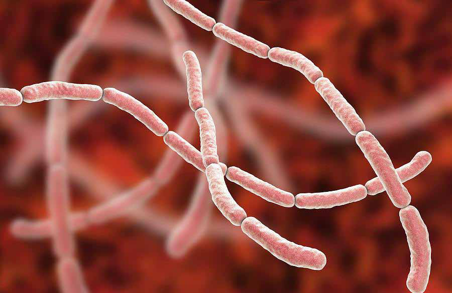

# A Legacy Etched in Courage: Farewell to Dr. S. Raviraj

Jaffna Monitor
hellojaffnamonitor@gmail.com
3
December 15, 2024
Fortnightly Edition
Rs. 750
Farewell to Dr. Raviraj: The 
Hands That Saved Jaffna
A Legacy Etched in Courage: 
Farewell to Dr. S. Raviraj
J
affna bids farewell to one of its most cherished and 
transformative figures, Dr. S. Raviraj, fondly called Iya by 
his students and colleagues. After dedicating over 40 years of 
unparalleled service to the people of Jaffna, Dr. Raviraj has 
retired, leaving behind a legacy that will inspire generations to 
come.
At a time when the northern region of Sri Lanka was engulfed in 
war and despair, many professionals sought refuge in prosperous 
countries. Yet, Dr. Raviraj charted a different course. Armed with 
surgical expertise honed in Singapore and Australia, he returned 
to the conflict-ravaged land he called home, trading the promise 
of a lucrative career abroad for the modest remuneration and 
challenges of rebuilding a shattered medical system in Jaffna.
The transformative impact of Dr. Raviraj's return to Jaffna cannot 
be overstated. Doctors across the region recount his visionary 
leadership in reorganizing and rebuilding the local healthcare 
system during its darkest days. His influence was profound as he 
inspired countless young doctors to pursue careers in surgery.
As Dr. Sutharshan Vengadasalam, a fellow surgeon at the Jaffna 
Teaching Hospital, poignantly remarked during Dr. Raviraj's 
farewell, "You can call any doctor with the suffix Iya, but if you 
say just Iya, it means Raviraj Iya alone." Dr. Sutharshan then 
shared a story that perfectly illustrates Dr. Raviraj's unparalleled 
influence.
During interviews for MD studies, a young and exceptionally 
qualified doctor, who could have easily pursued a specialized 
field like vascular surgery, opted instead for general surgery. 
Curious about this unusual choice, Dr. Sutharshan asked for an 
explanation. To his astonishment, the doctor replied, "I want to be 
a general surgeon like Iya."
Editorial

Jaffna Monitor
hellojaffnamonitor@gmail.com
4
Dr. Raviraj's career was forged in 
the crucible of peril, his resilience 
tested against the backdrop of war's 
savagery. Among the countless 
horrors he endured, one event 
remains etched in Jaffna's collective 
memory as a wound that refuses 
to heal—the 1987 Jaffna Hospital 
Massacre. Over 70 innocent lives 
were extinguished in cold blood by 
the Indian Peace Keeping Forces 
(IPKF), their heinous actions 
sparing neither renowned doctors 
nor the defenseless. Miraculously, 
Dr. Raviraj survived that harrowing 
ordeal, bearing witness to a chapter 
so dark it defies comprehension.
And yet, decades later, India—a 
nation draped in the sanctimonious 
cloak of Gandhian values—has 
neither apologized nor acknowledged 
its complicity in this atrocity. No 
gestures of remorse, no acts of 
contrition. Not even a whisper of 
accountability for the unspeakable 
carnage unleashed on a hospital.
Dr. Sivapathasundaram, a highly 
respected Consultant Paediatrician 
renowned for his unwavering 
dedication to saving lives—including 
one within my own family—was 
among the many who met a tragic 
and brutal end at the hands of the 
Indian Peace Keeping Force during 
that horrific carnage. He was last 
seen in the hospital corridors, 
walking alongside three nurses, their 
hands raised in surrender as they 
pleaded, "We are innocent doctors 
and nurses. Please don't kill us." 
Despite their desperate appeals for 
mercy, Dr. Sivapathasundaram was 
executed in cold blood while the 
nurses sustained severe injuries at 
the hands of a force claiming to be 
peacekeepers
The carnage reached its vile 
crescendo when a courageous lady 
doctor, the daughter of a prominent 
journalist, dared to confront an 
Indian Army officer in one of the 
hospital wards. She laid bare the 
horrifying reality unfolding around 
them, appealing to a shred of 
humanity in a force that had long 
forsaken it. It was only then, under 
the weight of her brave defiance, 
that the massacre was reluctantly 
subdued.
What followed was even more 
grotesque: all the bodies of 
those murdered by the IPKF—
patients, doctors, nurses—were 
unceremoniously gathered and 
burned. Not a shred of dignity, not a 
semblance of last rites, was afforded 
to the victims.
Apologists for this atrocity may 
argue that the LTTE fired upon 
the IPKF, triggering the massacre. 
Enough of these justifications. From 
its inception, the LTTE has operated 
under a leadership with no regard for 
sanctity—neither of life nor of public 
spaces. For Prabhakaran, every inch 
towards Tamil Eelam was worth any 
sacrifice, civilian or otherwise. But 
how does that justify the conduct 
of an army representing a nation 
that prides itself on the legacy of 
non-violence? How does a force

Jaffna Monitor
hellojaffnamonitor@gmail.com
5
For Donations:
Full Name	
: 	 JAFFNA MONITOR PUBLICATIONS
Bank Name	
: 	 National Development Bank PLC
Branch Name and Address	 : 	 No.30, KKS Road, Chunnakam, Jaffna
Account Number	
: 	 111000221437
SWIFT Code	
: 	 NDBSLKLX
Bank Address	
: 	 No.40, Nawam Mawatha, Colombo 2
Need more information?
Call or WhatsApp us at	
: 	 +94715418220
Email us at	
: 	 hellojaffnamonitor@gmail.com
supposedly driven by Gandhian ideals 
descend to such barbarity, staining its 
soul with innocent blood?
In private conversations with doctors 
who endured that harrowing chapter, 
a brutal truth surfaces: India cannot 
expunge the indelible stains of its past 
through silence. If it seeks absolution, 
it must act—not with perfunctory 
gestures but with acts of restitution 
commensurate with the enormity of 
its culpability. A meaningful initiative 
could be the construction of a state-
of-the-art 12-story clinical ward 
complex for the Jaffna Teaching 
Hospital, an ambitious project 
estimated at 1.7 billion Sri Lankan 
rupees.
While incapable of restoring the 
irreplaceable lives annihilated, such 
an endeavor could serve as a catalyst 
for reconciliation and a step towards 
assuaging the collective wounds. 
In the absence of tangible action, 
India's muteness remains a piercing 
indictment of its moral dereliction.
As we bid farewell to a towering 
figure like Dr. Raviraj, let us not only 
honor his legacy but also strive for 
a future where compassion triumphs 
over conflict and healing becomes the 
foundation of reconciliation.
fzpad; G+q;Fd;wd;
Kaniyan Pungundran
Editor-Jaffna Monitor

Jaffna Monitor
hellojaffnamonitor@gmail.com
6
Leptospirosis 
Identified as 
Cause of Fatal 
Fever in Jaffna
T
he fever outbreak in Jaffna, which has 
claimed seven lives to date, has been 
identified as Leptospirosis, commonly 
referred to as Rat Fever, according to the 
Epidemiology Unit of the Ministry of 
Health.
The victims, aged between 20 and 65, 
reportedly suffered from severe fever and 
respiratory complications. Blood samples 
sent to Colombo for detailed examination 
confirmed the presence of Leptospira 
bacteria.
Addressing the media, Jaffna Hospital 
Director Dr. Sathyamoorthy emphasized the 
importance of prompt medical intervention 
for individuals exhibiting symptoms such 
as high fever, muscle pain, and difficulty 
breathing. He reassured the public that 
hospital authorities are taking all necessary 
steps to manage and contain the outbreak.
BY: 
Our Reporter
Jaffna

Jaffna Monitor
hellojaffnamonitor@gmail.com
7
Leptospirosis, a bacterial infection transmitted 
through water contaminated with the urine 
of infected animals, often peaks during the 
rainy season. The Ministry of Health urges the 
public to take preventive measures, including 
avoiding stagnant water, maintaining proper 
hygiene, and seeking medical advice if 
symptoms appear.
Meanwhile, the Health Promotion Bureau 
has launched an investigation into the 
circumstances surrounding the disease's 
spread. Dr. Kumudu Weerakoon from the 
Epidemiology Unit stated that authorities 
are closely monitoring the situation and 
implementing preventive measures to limit 
further infections.
A team of medical specialists from the 
Epidemiology Division of the Ministry of 
Health in Colombo visited Jaffna on December 
12 to assess ground conditions. They 
conducted investigative activities and provided 
guidance on managing the outbreak.
The team, led by Dr. Praba Abeykoon, first 
visited the Jaffna Teaching Hospital, where 
they examined patients admitted to the 
emergency unit with fever symptoms and 
conducted on-site investigations. They also 
held discussions with Dr. T. Sathiyamoorthy, 
Director of the Jaffna Teaching Hospital, 
and Dr. T. Peranandarajah, who is a General 
Physician, to comprehensively evaluate the 
current situation.
Additionally, the specialists visited the Point 
Pedro Base Hospital, which has admitted 
many patients with Leptospirosis, to assess 
the conditions there. During their visit, they 
engaged with the hospital's medical officers, 
examined patients receiving treatment, and 
provided expert advice.
The team also conducted field visits to areas 
where infections have been reported to 
gather further insights and conduct in-depth 
investigations.
Raveendran, the son of a leptospirosis 
victim, told Jaffna Monitor: "After the floods

