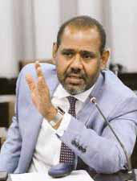
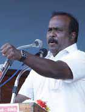
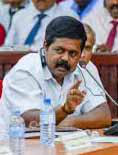

# Tamil Nationalist Leaders:

Jaffna Monitor
hellojaffnamonitor@gmail.com
22
F
aced with an unexpected blow dealt by 
the ruling NPP, which clinched 3 out of 6 
parliamentary seats in the recently concluded 
Jaffna electoral district elections, Tamil 
nationalist leaders have launched a flurry of 
meetings aimed at uniting their fractured 
ranks—and perhaps, as skeptics put it, 
continuing their tradition of hoodwinking the 
Tamil people.
In the latest episode of this political drama, 
Sritharan and Gajendrakumar Ponnambalam 
sat down to discuss strategies for patching 
up their differences and presenting a united 
front. The meeting, however, did not escape 
the watchful eyes of political commentators, 
who gleefully noted the irony as Sritharan had 
publicly lambasted Ponnambalam with some 
choice unflattering remarks just days before 
the polls.
Yet, in a display of classic political 
opportunism, the two leaders appear to have 
buried their hatchets—not in each other, 
surprisingly—but in the name of a "greater 
cause." Their newfound camaraderie, while 
raising eyebrows, seems to be less about 
principle and more about survival in a political 
landscape suddenly shaken by the NPP's 
success.
Tamil Nationalist Leaders: 
United by Defeat, Divided 
by Everything Else
BY: 
Our Reporter
Jaffna

Jaffna Monitor
hellojaffnamonitor@gmail.com
23
In a parallel effort, Gajendrakumar 
Ponnambalam recently met with Selvam 
Adaikalanathan, the leader of the Eelam 
People's Revolutionary Liberation 
Organization (EPRLF), in Kilinochchi 
to discuss future political strategies. 
Adaikalanathan, who scraped through to 
victory in the Vanni electoral district by a 
razor-thin margin, now holds the dubious 
distinction of being the MP with the fewest 
preferential votes in the last election—a title 
nobody's likely to envy.
According to sources, the two leaders reviewed 
a draft resolution prepared by the Tamil 
People's Council, which has been pitched 
as a potential roadmap for uniting Tamil 
nationalist forces. However, the question 
remains: what kind of "unity" are we talking 
about here?
Gajendrakumar Ponnambalam is willing 
to use the Tamil People's Council's draft 
resolution as a springboard for broader 
discussions with other Tamil political parties. 
Ponnambalam stressed the need for "collective 
action" to champion the rights and aspirations 
of the Tamil community—a sentiment that 
conveniently doubles as a survival strategy in 
the wake of recent electoral shake-ups.
Echoing these unity vibes (and likely their 
own political anxieties), Sivagnanam Sritharan 
and Selvam Adaikalanathan have also 
signaled their openness to dialogue. Sritharan, 
chairperson of the ITAK parliamentary group, 
put on his statesman hat to emphasize the 
importance of setting aside differences "for the 
greater good of the Tamil people." Meanwhile, 
Adaikalanathan, perhaps still reeling from his 
razor-thin victory in the Vanni district, talked 
up the need for consensus on shared political 
priorities to achieve "meaningful progress."
The recent parliamentary elections in Sri 
Lanka delivered a seismic jolt to Tamil 
nationalist parties, exposing their dwindling 
clout even in their long-standing stronghold—
the Jaffna Peninsula, often regarded as the 
heartland of Tamil nationalism. In an outcome 
that few saw coming, the National People's 
Power (NPP), a predominantly Sinhala party 
that has made no secret of its disregard for the 
13th Amendment, grabbed three of the six 
seats in Jaffna, leaving political observers in 
shock.
Adding to the drama, one seat was clinched 
by the polarizing figure of Dr. Aruchchuna 
Ramanathan, the doctor-turned-politician 
whose entry into the political arena has been 
as controversial as it has been surprising. This 
left Tamil nationalist parties clinging to just 
two seats: one held by Sivagnanam Sritharan 
of the Illankai Tamil Arasu Kachchi (ITAK) 
and the other by Tamil National People's Front 
(TNPF) leader Gajendrakumar Ponnambalam.
The election results have been nothing short of 
a wake-up call for Tamil nationalist leaders, a 
political observer noted to Jaffna Monitor. One 
commentator cheekily described their current 
actions as a desperate "survival dance." With 
their grip on the Tamil electorate slipping, 
these leaders are now frantically scrambling 
to save face, rework strategies, and cobble 
together alliances—doing whatever it takes to 
keep their political relevance afloat.
For voters, however, the spectacle of their 
leaders' newfound urgency is likely to 
evoke a mix of amusement and skepticism. 
Whether this "dance" will result in meaningful 
change or simply more theatrics remains 
to be seen. One thing is clear: the political 
landscape in Jaffna and other Tamil-speaking 
areas is shifting, and critics suggest that 
Tamil nationalism may no longer be the 
unchallenged force it once was.

