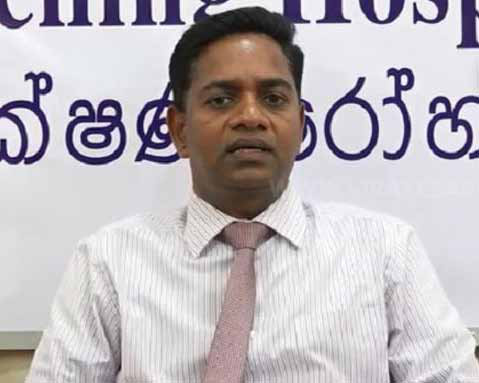

# Monitor Memo

Jaffna Monitor
hellojaffnamonitor@gmail.com
24
D
r. Thangamuthu Sathyamoorthy, Director 
of Jaffna Teaching Hospital, stated 
that if Member of Parliament Ramanathan 
Archchuna, widely regarded as an "unfit" MP 
lacking the emotional intelligence necessary 
to represent the people, attempts to disrupt 
the hospital's operations again, he will be 
stopped at the entrance by security personnel 
and handed over to the police. He made these 
remarks during a press briefing.
Elaborating further, Dr. Sathyamoorthy 
recounted the incident, saying, "During 
his recent show-up visit to Jaffna Teaching 
Hospital, MP Archchuna identified himself 
as a Member of Parliament and demanded 
that he be addressed as 'Sir.' When we firmly 
replied that we would not address him in such 
a manner, he threatened to have me removed 
from my position as Director of the hospital. 
He went further, claiming he would summon 
me to Parliament for questioning and even 
suggested that I should flee the country. I told 
him, quite plainly, to do whatever the hell he 
can."
Dr. Sathyamoorthy emphasized that the 
hospital cannot allow disruptions caused 
by MP Archchuna or anyone else within its 
premises.
If MP Archchuna attempts to create any 
further disturbances inside the Jaffna Teaching 
Hospital, he will be stopped at the entrance 
by security officers and handed over to the 
police," Dr. Sathyamoorthy reiterated.
Meanwhile, another doctor, speaking to Jaffna 
Monitor on condition of anonymity, remarked 
with evident frustration, "Not only should he 
be stopped at the entrance and handed over to 
the police, but he should also be tied up and 
treated in a mental hospital.
Monitor Memo
 MP's Ego Check-Up Goes Wrong: Jaffna 
Hospital Prescribes Security at the Door!

