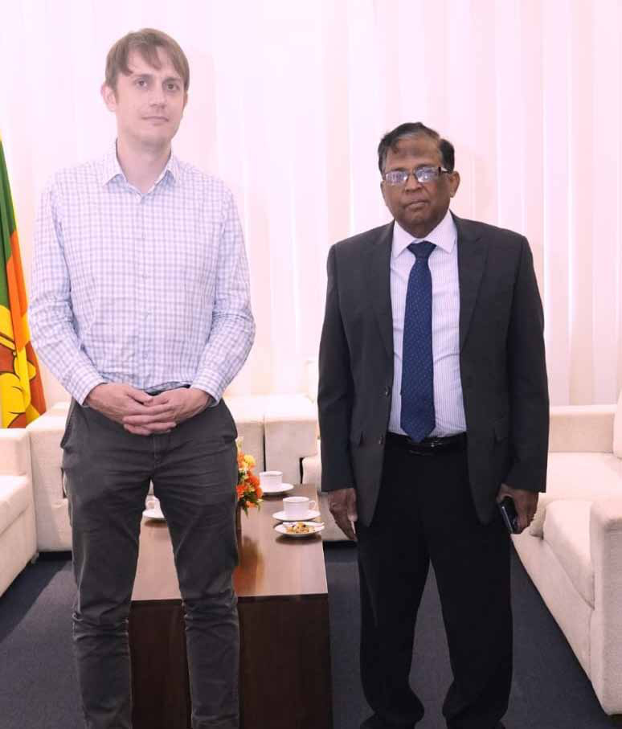

# Monitor Memo

Jaffna Monitor
hellojaffnamonitor@gmail.com
25
N
orthern Province Governor N. 
Vethanayagan has urged the release of 
lands still under the control of the security 
forces, emphasizing that addressing land-
related grievances is critical for the welfare 
of the region. The Governor made these 
remarks during a recent meeting with Henry 
Donati, the First Secretary for Peacebuilding 
and Human Rights at the British High 
Commission, at the Northern Province 
Governor's Secretariat.
In a statement released by the Governor's 
office, Vethanayagan highlighted the 
ongoing challenges faced by the people of 
the Northern Province. He pointed out that 
during the war, when people in the region 
were displaced, some of their lands were 
designated as protected areas under the Forest 
Department and the Department of Wildlife 
through gazette notifications. He noted that 
these actions have significantly disrupted 
livelihoods, particularly for farmers, and 
remain a pressing concern for the community.
Progress Amid Challenges
While acknowledging the existing challenges, 
the Governor highlighted some positive 
developments in the region. He commended 
Monitor Memo
Governor Vethanayagan Calls for Release 
of Lands Under Military Control

Jaffna Monitor
hellojaffnamonitor@gmail.com
26
the reopening of a 
previously closed road in 
Valikamam North, which 
had been under military 
control for years, calling it 
a step in the right direction. 
However, he noted that 
many other roads and lands 
remain under military 
control, with public calls 
for their release continuing 
unabated.
Governor Vethanayagan 
also pointed out the 
removal of numerous 
checkpoints and roadblocks 
previously established 
by security forces. He 
described this as a 
significant measure that 
has improved mobility 
and bolstered public 
confidence.
Focus on Development 
and Investment
Highlighting economic 
prospects, the Governor 
revealed plans for an 
investors' conference next 
year to attract investment 
to the Northern Province. 
He praised the current 
government for fostering 
investor confidence and 
shared plans to expand 
the runway at Jaffna 
International Airport 
in Palaly, which he said 
would boost economic 
opportunities and generate 
jobs for local youth.
Support for Refugees
Addressing the plight of Sri Lankan Tamil refugees in Tamil 
Nadu, India, the Governor noted that approximately 100,000 
refugees reside there. He assured that the government is 
prepared to extend livelihood and housing support to those 
who wish to return.
Infrastructure and Gratitude
Governor Vethanayagan also drew attention to the region's 
infrastructure gaps, particularly the poor condition of interior 
roads, and expressed hope that the government would address 
these issues during its tenure. Concluding the meeting, the 
Governor conveyed his gratitude to the British government for 
its past support to the Northern Province through UN agencies 
and various other initiatives, according to a press release from 
the Governor's office.

