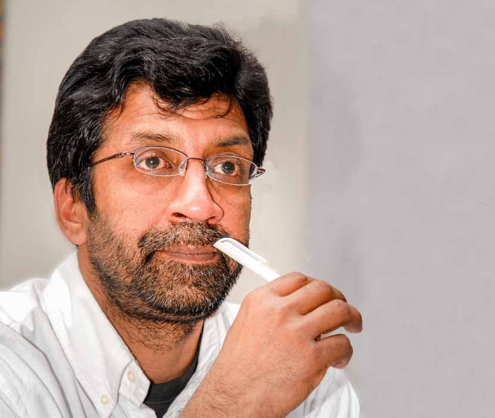
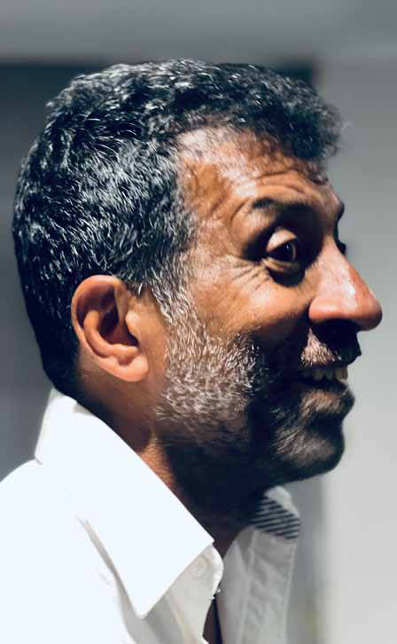
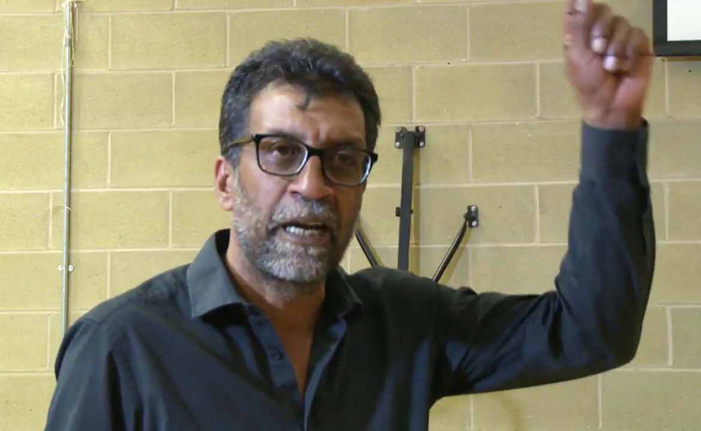
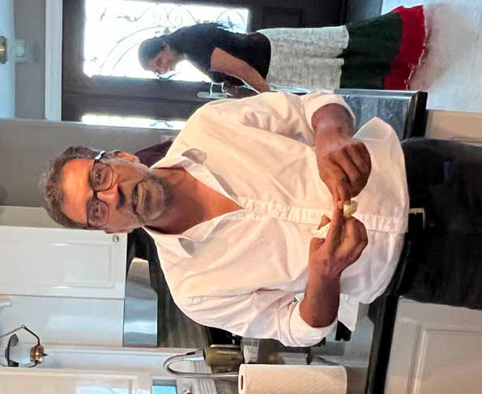

# The Most Brutal Internal Killings Took Place in PLOTE: 'PLOTE's Killing Squad Began to Enjoy It, Asking, Is There No One Left to Kill?'

Jaffna Monitor
hellojaffnamonitor@gmail.com
27
INTERVIEW
The Most Brutal Internal Killings 
Took Place in PLOTE:  'PLOTE's Killing 
Squad Began to Enjoy It, Asking, Is 
There No One Left to Kill?'
BY: 
Our Special 
Correspondent
LTTE Co-Founder Ragavan
Part-3
C
hinniah Rajeshkumar, better 
known as Ragavan, co-
founded the LTTE and played a 
pivotal role in its formative years 
alongside its leader, Prabhakaran. 
Disillusioned by rising extremism, 
internal power struggles, and the 
cult-like loyalty to Prabhakaran, 
Ragavan parted ways with the 
LTTE in April 1984 and relocated 
to London. Now a legal advisor 
and activist, he provides unique 
insights into Tamil nationalism 
and the LTTE's tumultuous 
history. In this exclusive Jaffna 
Monitor interview, Ragavan shares 
insider perspectives and reflections 
on the current political landscape. 
This is Part 3 of the series.

Jaffna Monitor
hellojaffnamonitor@gmail.com
28
You and LTTE leader Prabhakaran 
were both involved in the infamous 
Pondy Bazaar shooting on May 19, 
1982. Can you recount the events of 
that day and what led to this dramatic 
encounter?
The Pondy Bazaar shooting was closely tied 
to the tensions that arose after the People's 
Liberation Organisation of Tamil Eelam 
(PLOTE) split from the LTTE in 1979. 
Uma Maheswaran defected from the LTTE 
following rumors about his relationship with 
Urmila, which prompted him to establish 
PLOTE.
Is there any truth to the story about an 
alleged relationship between Urmila 
and Uma Maheswaran?
In 1979, a rumor suggested that Uma 
Maheswaran and Urmila were romantically 
involved, quickly spiraling into a major 
controversy. Anton Balasingham, who was 
in India at the time, attempted to defuse the 
situation by referencing Freud's theory of 
sexuality. He argued that having sexual desires 
is natural and not a sin. However, despite 
his efforts, Prabhakaran and others were 
unwilling to accept this perspective.
Initially, Balasingham tried to mediate, but he 
eventually aligned himself with Prabhakaran's 
stance—a pattern he maintained consistently 
until his death. In my opinion, this incident 
underscores the deeply entrenched 
misogynistic views and biases within the 
LTTE leadership and the organization as a 
whole.
Was there any actual basis for this 
rumor?
There was no concrete evidence, but 
individuals like Nagarajan Master speculated 
that Uma and Urmila's romantic involvement 
might have begun even before they joined 
the movement. The troubling aspect of this 
situation was that all the blame was placed 
squarely on Urmila. In our cultural context, 
it is often women who bear the brunt of such 
controversies.
This wasn't solely Prabhakaran's perspective; 
it reflected a deeper, male-centered patriarchal 
cultural bias. Consequently, Urmila was 
forced out of the organization, while Uma 
Maheswaran was allowed to remain as an 
ordinary member.
They conveniently overlooked Urmila's 
unwavering dedication. She undertook many 
daring tasks for the organization, operating 
covertly out of Colombo and accepting high-
risk assignments. For instance, she printed 
the first public statement by the Tigers 
claiming responsibility for the assassination of 
Inspector Bastiampillai and others.
What happened after the split of the 
LTTE and the formation of PLOTE?
After the split, Uma Maheswaran managed to 
persuade some disillusioned LTTE members, 
who were dissatisfied with Prabhakaran's 
authoritarian leadership, to join him. 
Sundaram, a senior figure in the LTTE, also 
supported Uma Maheswaran, and together, 
they established PLOTE.
According to LTTE doctrine, anyone who left 
the organization to form a rival group was 
marked for elimination. This rigid and deeply 
undemocratic principle denied individuals 
the basic right to hold differing political 
views or create alternative organizations. As a 
result, Uma Maheswaran and the members of 
PLOTE became prime targets.

Jaffna Monitor
hellojaffnamonitor@gmail.com
29
What was your stance at the time of 
the split?
When the split occurred, I initially supported 
Prabhakaran. However, after the split, 
Prabhakaran sought to consolidate full control 
over the LTTE and establish himself as its 
supreme leader. This shift raised concerns 
among some of us. Mano Master and I 
and others opposed this move, believing it 
contradicted the principles we stood for. In 
response, Prabhakaran made the decisive 
choice to leave the LTTE and chart his own 
path. Although I sympathized with him, I 
remained steadfast in my principles.
Where did Prabhakaran go after 
leaving the LTTE?
After leaving the LTTE, Prabhakaran joined 
TELO and began working under Thangathurai, 
acknowledging his sole leadership. Initially, 
Prabhakaran was the only one to join TELO. 
Later, he successfully persuaded several 
former LTTE members, including Seelan and 
Mathaya, to follow him into TELO. However, I 
chose not to join him at that time.
While Thangathurai retained ultimate 
authority, the former LTTE members who 
joined TELO at Prabhakaran's request 
operated under his command.
Thangathurai envisioned a structure where 
Prabhakaran would oversee the LTTE guards, 
functioning as a division commander, while 
ultimate leadership firmly remained with 
Thangathurai. Prabhakaran wholeheartedly 
accepted this arrangement, guided by his 
philosophy: "Either I lead, or I follow someone 
loyally." During this period, his loyalty to 
Thangathurai was unwavering.
Prabhakaran once remarked that Thangathurai 
had told him, "If anything happens to me, the 
future leadership must be collective.
Prabhakaran issued an unofficial death 
sentence, according to LTTE doctrine, 
on Uma Maheswaran for leaving the 
LTTE and forming a new organization. 
But Prabhakaran himself left the LTTE 
and joined TELO. Who would hold him 
accountable or sentence him to death?
(Laughs) If you truly understand 
Prabhakaran's mindset, this question wouldn't 
arise. When Prabhakaran made such moves, 
they were deemed acceptable; it was only 
considered wrong when others did the same.
Questioning him was simply out of the 
question. If accountability were to apply, he 
would have had to impose a death sentence on 
himself.
However, there was a rationale behind his 
actions—Prabhakaran only joined TELO 
after officially disbanding the LTTE. From his 
perspective, this allowed him to argue that 
TELO was the sole legitimate representative of 
the Tamil nationalist cause at that time.
There are rumors that Prabhakaran 
betrayed Kuttimani and Thangathurai 
to the Srilankan security forces. 
What's your take on that?
I don't agree with that at all. Prabhakaran's 
mindset was entirely different. While it 
was known as TELO, its core structure and 
network were essentially built on the LTTE's 
foundation. If Prabhakaran had betrayed 
Kuttimani and Thangathurai, it would have

Jaffna Monitor
hellojaffnamonitor@gmail.com
30
been tantamount to betraying his own network. 
That's something he could never do. It goes against 
everything he stood for.
What happened after the arrest of 
Kuttimani and Thangathurai?
After Kuttimani and Thangathurai were arrested 
and detained by the security forces in April 1981, 
the leadership of TELO underwent a significant 
shift. Sri Sabaratnam, Prabhakaran, and Panth 
Anna—whose real name I've forgotten but whom 
we humorously nicknamed Panth Anna due to his 
flamboyant demeanor (ge;jh fhl;Ljy;)—took 
over as joint leaders and key decision-
makers within TELO.
At that time, I chose not to join TELO 
immediately and instead remained 
in Chennai. Prabhakaran personally 
visited me there, passionately appealing 
for my support and urging me to join 
the organization. While I initially had 
my reservations, I always admired 
Prabhakaran's unwavering dedication 
to the national liberation struggle. It 
was solely for that reason that I decided 
to join hands with him and become 
part of TELO.
It's important to clarify that I joined 
TELO only after Kuttimani and 
Thangathurai were arrested. I was 
not part of Thangathurai's leadership 
during their tenure.
PLOTE leader' Puthiya Pathai' 
Sundaram's assassination 
was the first instance of 
fratricidal killing among Tamil 
militant groups. ( Although 
internal killings of Kannadi 
Pathamanathan, Patkunam, 
and Micheal happened, this 
was the first time the LTTE 
killed a member of another 
militant organization) What 
exactly happened? Who killed 
Sundaram, and why?
On January 2, 1982, Sundaram 
(Sadasivam Sivasankaran) was 
assassinated at Chitra Press in Jaffna. It 
was Prabakaran who made the decision 
and got approval from Sri sabaratnam

Jaffna Monitor
hellojaffnamonitor@gmail.com
31
and Panth .   This plan was not known to all 
the members working under Prabhakaran's 
leadership within TELO. Prabhakaran's 
loyalists, Sellan and Pandithar, were selected to 
carry out the assassination.
By the time of his murder, Sundaram had 
become a prominent figure in the Tamil 
nationalist movement. He was the editor 
of Puthiya Pathai, a magazine that openly 
criticized the Tamil United Liberation Front 
(TULF) leadership, making him an influential 
and vocal critic.
In addition to his role as a critic, Sundaram 
had also established himself as a key military 
leader for PLOTE. Just days before his 
assassination, he led a daring and highly 
successful raid on Anaikoddai, which further 
elevated his reputation.
Prabhakaran perceived both Sundaram and 
the Anaikoddai operation as direct threats to 
the LTTE's political ambitions. To eliminate 
this perceived danger, he ordered Sundaram's 
assassination, marking the first instance of 
fratricidal violence among Tamil militant 
groups.
There were rumors that TULF 
leader Amirthalingam was 
indirectly involved in Sundaram's 
assassination. Some unconfirmed 
reports suggest that when a fellow 
TULF member complained about 
Sundaram's criticism of the TULF 
leadership, Amirthalingam allegedly 
responded, saying, "Re;juj;ij 
jk;gp ghu;j;Jf; nfhs;thd;" 
(Translation: "Thambi [Prabhakaran] 
will take care of Sundaram.") Do you 
believe this narrative?
I don't think so. While it's possible that 
Amirthalingam was angry about Sundaram's 
criticism of the TULF, I am not convinced that 
he would have made such a statement.
After the Pondy Bazaar shooting, 
Amirthalingam visited India and attempted 
to mediate between Prabhakaran and 
Umamaheswaran, urging them to resolve their 
differences amicably. However, Prabhakaran 
was adamant and outright rejected 
Amirthalingam's suggestion. In fact, he was 
furious with Amirthalingam and reportedly 
remarked, "If he supports Umamaheswaran, 
I'll put a bullet in his bald head."
While it's true that Prabhakaran had 
connections with Amirthalingam, it's 
equally true that Umamaheswaran also had 
ties with him. Before joining the LTTE, 
Umamaheswaran served as the secretary of the 
TULF Youth Wing in Colombo.
What were the repercussions of 
Suntharam's assassination?
Following Suntharam's assassination, PLOTE 
retaliated by killing known LTTE supporters 
Iraikumaran and Umaikumaran. Iraikumaran, 
though not an official member, was a 
supporter of the LTTE, while Umaikumaran 
had once been a member but had since left the 
organization. Iraikumaran, loosely affiliated 
with the Tamil United Liberation Front 
(TULF), had little real involvement in militant 
activities—he merely ran a dairy farm. They 
were both from the same village and were 
friends. I heard that the PLOTE members 
visited their house and asked them to come 
with them for an inquiry, and both were shot. 
The rest is history.

Jaffna Monitor
hellojaffnamonitor@gmail.com
32
Given his disciplined nature as 
fighters, how were Seelan (Charles 
Lucas Anthony) and Pandithar 
(Sinnathurai Raveenthiran) 
influenced to carry out Suntharam's 
assassination?
It's straightforward: Seelan was told that 
only one liberation movement—the LTTE—
could lead the Tamil struggle. Believe me, 
in the early 1980s, the LTTE's political 
propaganda was focused less on the Sri 
Lankan government and more on rival 
groups like PLOTE. Demonstrating loyalty 
to Prabhakaran and the Tigers wasn't about 
fighting the military; it was about eliminating 
members of competing organizations, 
gathering intelligence on rival factions, and 
assassinating their members. In the 80s, they 
had 'political' classes for the new recruits, and 
the class was mainly about PLOTE, and the 
theme was why they should be eliminated.
How did you react to Sundaram's 
assassination? What was your state of 
mind?
Although I was unaware of the plan at the 
time, as a member of TELO, I still feel a sense 
of moral responsibility. This is a complex 
phenomenon to grapple with—being part 
of an authoritarian organization that carried 
out such heinous acts means that, even if one 
is not directly involved, membership itself 
confers a degree of accountability.
I was deeply unhappy about Sundaram's 
murder, recognizing that it could ignite a 
fratricidal conflict with PLOTE. However, I 
faced a profound dilemma: should I continue 
with the organization for the sake of the 
national liberation struggle, or should I leave? 
Despite my unease, I cannot deny my moral 
responsibility as I chose to remain with the 
LTTE even after Sundaram's assassination.
This internal struggle weighed heavily 
on me, particularly as tensions began to 
surface between Prabhakaran and TELO. 
I came to believe that the LTTE needed to 
be re-established, as I felt TELO lacked the 
commitment and focus necessary for the 
national liberation cause.
In your view, what was the problem 
with TELO?
TELO lacked substance and serious 
dedication. In some ways, it functioned like a 
Varuthapadatha Valibar Sangam (a "Club of 
Carefree Youth"). Let me give you an example 
to explain why I say this. During a training 
session I conducted, I was deeply frustrated 
to see TELO leaders Sri Sabaratnam and 
Panth engrossed in a heated argument—not 
about strategy or the movement, but about 
whether Bharathiraja or Bhagyaraj was the 
better director. At one point, they passionately 
debated which movie was superior: Tik Tik 
Tik by Bharathiraja or Vidiyum Varai Kaathiru 
by Bhagyaraj.
What baffled me was that they spent hours 
on this trivial dispute, completely wasting 
valuable time. This lack of seriousness not 
only frustrated me but also the LTTE fighters 
aligned with TELO.
Meanwhile, tensions were simmering between 
Prabhakaran and Sri Sabaratnam. Although I 
wasn't privy to all the details, it was clear their 
relationship was strained. These tensions and 
TELO's lack of focus led to a breaking point. 
A couple of months before the Pandy Bazaar 
incident, Prabhakaran and a few of us decided 
to part ways with TELO. We left it behind to

Jaffna Monitor
hellojaffnamonitor@gmail.com
33
re-establish the LTTE and reignite our mission 
with renewed purpose.
What happened after re-establishing 
the LTTE? And what events led up to 
the Pandy Bazaar shooting incident?
After leaving TELO, we found ourselves with 
limited resources. We had no access to funds, 
including the money from the Neerveli bank 
robbery, which Prabhakaran firmly believed 
belonged to TELO. Respecting his decision, 
we took only the weapons we had acquired 
prior to joining TELO. Around this time, some 
PLOTE members, including Umamaheswaran, 
fled to India after robbing the Kilinochchi 
bank in October 1981.
Following Sundaram's assassination, tensions 
between the LTTE and PLOTE escalated 
significantly, with reports suggesting that 
PLOTE was actively seeking revenge against 
us. Prabhakaran and I typically carried 
weapons, as I had been wanted by the Sri 
Lankan government since 1976. In India, 
however, where there was no immediate threat 
from Sri Lankan forces, carrying arms was 
generally uncommon. Nevertheless, due to the 
rivalry with PLOTE and the persistent danger 
it posed, we continued to carry weapons for 
our safety.
I wanted to avoid any confrontations and 
urged Prabhakaran not to engage in violent 
actions while in India, where civilians were 
unaccustomed to firearms and might react 
unpredictably or aggressively. However, he 
dismissed my caution, declaring his intent 
to kill Umamaheswaran if he encountered 
him anywhere. This defiance of restraint set 
the stage for the Pandy Bazaar shooting, an 
event that would further intensify the already 
volatile situation.
What exactly happened on the 
infamous Pandy Bazaar shooting day?
On the day of the incident, on May 19, 1982, 
I was with Prabhakaran, Nesan, and a friend 
of Prabhakaran's from Germany, whose name 
I can't recall. This friend had invited us to a 
movie and then took us to a popular restaurant 
in T. Nagar for a meal. We had string hoppers. 
As we were leaving the restaurant, we saw 
Uma Maheswaran and Kannan, PLOTE's 
military head, on a motorcycle. We thought 
they were following us to kill us. Prabhakaran 
and I instructed the other two to distance 
themselves and act as if they were not with us.
We believed they were following us with the 
intent to kill, while they likely thought the 
same. Gunfire erupted. Kannan was taking a 
position to defend, but Uma Maheswaran did 
not; he managed to escape. Uma was known 
for fleeing in such situations, while Kannan 
held his ground. Unfortunately, Kannan's 
gun malfunctioned, and he was ultimately 
wounded by, I believe, five bullets.
Do you think that they were indeed 
following you with the intent to kill in 
Pondy Bazaar?
It's quite possible. Their presence in a crowded 
area like T. Nagar without any apparent 
reason seemed suspicious. As we were 
leaving, they stood beside their motorcycle, 
raising concerns. While this might have 
been a coincidence, I can't say with complete 
certainty what their intentions were.
Some accounts suggest you and 
Prabhakaran reacted impulsively and 
immediately opened fire upon seeing 
them. Is that accurate?

Jaffna Monitor
hellojaffnamonitor@gmail.com
34
No, it is not entirely correct. The situation 
at the time was already extremely tense, and 
when we encountered Uma and Kannan, we 
assumed that they were following us to kill us, 
and it was both impulse and fear.
What happened after that?
We were arrested and detained for three 
months in Chennai Central Jail. After 
that, we were granted conditional bail. As 
part of the bail conditions, I was placed in 
Pudukottai, Prabhakaran in Madurai, and 
Uma Maheswaran in Chennai. We were each 
guarded by two policemen and were strictly 
prohibited from traveling to another city.
While I was out on bail in Puthukoddai, I 
was somewhat mischievous with the police 
officers assigned to guard me. I would rent a 
bicycle and ride as fast as I could, forcing the 
poor policemen to chase after me on their 
bikes. While in Puthukoddai, I met members 
and supporters of various political parties, 
including the DMK, the Communist Party, 
and the DK. I shared insights about the Tamil 
national struggle with them, and they often 
visited me for discussions. They treated me 
with great respect and took good care of me.
With their support, I would sometimes ask 
them to stay in my room while the police 
remained outside. Taking advantage of 
this, I would secretly slip out through the 
back door and travel to Madurai to meet 
Prabakaran. Similarly, I clandestinely met 
with Sivaneswaran, a PLOTE member who 
was later killed on Uma Maheswaran's orders. 
During our meeting, we spoke openly about 
the destructive nature of factional conflicts. 
Despite our ideological differences, we 
developed a mutual respect for one another. 
During our conversation, he revealed

Jaffna Monitor
hellojaffnamonitor@gmail.com
35
something startling—he had once followed me 
to a garage where I used to receive letters.
This led me to realize that Uma Maheswaran 
and Kannan might have been following 
us with the intent to kill us. Given the 
circumstances and the escalating rivalries at 
the time, it was certainly a plausible possibility.
Was Sivaneswaran a high-ranking 
member of PLOTE at that time?
At that time, only a small number of 
individuals were involved in militant 
movements, so nearly everyone carried 
significant responsibilities. Sivaneswaran was 
a  prominent member.  It was only after the 
state-sponsored violence of 1983 that youth 
began joining the liberation movements in 
large numbers. If not for the orchestrated 
riots of July 1983 under the J.R. Jayewardene 
government, these militant organizations 
might never have grown to the extent that they 
eventually did.
What happened to Sivaneswaran?
As I mentioned earlier, following the 1983 
riots, many young people joined various 
liberation movements. However, the internal 
killings and pervasive lawlessness within these 
groups led many to leave as well. Sivaneswaran 
was one such individual who chose to walk 
away from PLOTE in 1984, the same year I 
decided to leave the LTTE.
I met Sivaneswaran again after I left the LTTE 
in April 1984. During our conversation, 
I warned him to completely avoid any 
association with PLOTE, emphasizing 
that these were essentially murderous 
organizations.
This wasn't just my view of PLOTE but 
also of TELO and the LTTE—when it came 
to senseless killings, there was little to 
differentiate them. Sivaneswaran assured me 
that he was planning to move to a safer place, 
specifically the MLA hostel in Chennai, where 
PLOTE members occasionally gathered.
Tragically, he was later abducted from there 
by PLOTE members, brutally tortured, and 
ultimately killed on Uma Maheswaran's 
orders. His brother Wigneswaran, who had 
traveled from Sri Lanka to India upon hearing 
of his abduction, was reportedly killed by 
PLOTE as well.
Wigneswaran's daughter, Kavitha Laxmi, a 
gifted dancer with a grace that captivates, 
now resides in Norway. When I had the 
opportunity to meet her, I could sense the 
weight of unanswered questions she carries. 
She is still searching for the truth—how, 
where, and why her father was taken from her.
During your time, which organization 
had the highest number of internal 
killings?
That would be PLOTE in the 80s. The 
most brutal internal killings took place 
within their ranks. PLOTE was initially 
founded on anti-LTTE rhetoric, branding 
the Tigers as a dictatorial movement led 
by Prabhakaran, whom they accused of 
authoritarianism. PLOTE promoted socialist 
ideals, attracting influential figures such 
as  Santhathiyar, Govinthan, and Selvi, who 
saw it as a democratic alternative. However, 
as the movement expanded after the 1983 
riots, PLOTE's leadership grew increasingly 
insecure. Although they projected a 
democratic image, they were anything but. 
Uma Maheswaran and his associates actively 
suppressed any democratic principles within 
the organization.

Jaffna Monitor
hellojaffnamonitor@gmail.com
36
In contrast, anyone joining 
the LTTE understood that 
it was a strictly controlled, 
non-democratic organization. 
Dissent was rarely tolerated, 
and expressing opposing 
views often led to severe 
consequences. I shared my 
concerns about the LTTE 
only with a few close friends 
and with Anton Balasingham 
within the organization, 
as openly criticizing the 
movement was extremely 
dangerous—especially after 
1983.
I estimate that PLOTE was 
responsible for at least a 
hundred internal killings. 
Some former members  of 
PLOTE recently told me that 
the killing squad of PLOTE 
began to "enjoy" the act of 
killing, even asking, "Is there 
no one left to torture or kill 
today?" I was taken aback 
to hear this. Others didn't 
enjoy it but felt they had no 
choice, claiming they were 
simply following orders. 
Many believed that if their 
leader, Uma Maheswaran, 
commanded it, it must be for 
a justified reason.
When you are intensely loyal 
to an organization and its 
leadership, that loyalty can 
compel you to do almost 
anything. This issue is not 
unique to militant groups; it 
can also be observed within 
a sovereign state's military 
and police establishments. Brutality can become normalized. 
Initially, killing may feel shocking, but with repetition, it 
becomes routine—an act embedded within the system.
Did some members of the LTTE seem to take 
pleasure in these killings?
Yes, certain members did seem to derive enjoyment from it. 
But, as with any organization, there were different types of 
individuals. From my observations, the most skilled fighters 
and genuine leaders were usually not involved in torture 
or needless killings. Those who were often responsible for 
internal killings tended to be individuals unfit for real combat 
and, quite frankly, cowards.
For example, there was an LTTE member ironically 
nicknamed Gandhi, despite being a notorious killer. Another 
was Kittu, who served as the LTTE's Jaffna commander. Kittu 
was known for his problematic behavior—he frequently 
abused and even physically assaulted others within the

Jaffna Monitor
hellojaffnamonitor@gmail.com
37
organization. Despite these tendencies, 
he was promoted because of his loyalty to 
Prabhakaran, who granted him significant 
freedom to act as he pleased.
When did you reach the point of 
deciding you could no longer remain in 
the Tigers? What factors contributed 
to that decision?
My departure from the LTTE wasn't a single 
event but rather a gradual process influenced 
by various incidents over time. In 1980, 
following the internal killings of Michael and 
Paragunam, the LTTE split. At that time, I 
strongly supported Prabhakaran, believing 
that everyone in the organization—especially 
the central committee (not an elected body but 
one appointed primarily by Prabhakaran)—
should share collective responsibility for 
these killings. Holding Prabhakaran solely 
accountable seemed unfair to me. I argued 
that if necessary, Prabhakaran could step down 
or the organization could adopt collective 
leadership, but singling him out as the sole 
cause felt unjust.
While a few of us remained loyal to 
Prabhakaran, most senior members, including 
figures like Iyer and Nagarajan Master, 
sided against him. The group supporting 
Prabhakaran comprised around eighteen 
individuals, including Ponnamman, Anton 
Master, and Mathaya, while about twenty-five 
others joined the opposing faction. Some, like 
Kumarappa, left the organization. He went 
to London for his studies but returned to the 
Tigers after the 1983 riots.
Shortly after the split, I went to India, 
where Prabhakaran began collaborating 
with Kuttimani and Thangathurai's TELO 
organization. As I mentioned earlier, 
Prabhakaran approached me personally, 
explaining the alliance with TELO and 
urging me to return. Although I wasn't fully 
convinced, I trusted Prabhakaran's dedication, 
so I agreed and resumed my role training new 
recruits in Madurai around 1981.
In this role, I took full responsibility for the 
training process—structuring schedules, 
designing routines, and managing daily 
activities. I even created a comprehensive 
regimen covering everything: wake-up times, 
training sessions, discussions, meals, and rest 
periods. In a way, I became a mini-dictator 
in the training camp (he laughs). Inspired by 
Che Guevara's writings, I also taught guerrilla 
tactics to the recruits.
However, tensions between TELO and 
Prabhakaran began to surface, especially after 
the arrests of Kuttimani and Thangathurai. 
I stood firmly with Prabhakaran at that 
time, believing the Tigers should operate 
independently.
After the 1981 gunfight at Pondy Bazaar, I 
made it clear that if internal conflicts like this 
persisted, I would eventually have to leave 
the organization. Shortly after the Pondy 
Bazaar incident, I stepped away and stayed in 
Jayanagar, Bangalore.
Later, following the 1983 riots, Anton 
Balasingham reached out to me and urged me 
to rejoin the Tigers. I did return, but I became 
increasingly disillusioned with the growing 
intolerance within the organization and its 
shift toward authoritarian centralization 
around Prabhakaran. The LTTE was losing all 
semblance of democratic principles. By April 
1984, I made the decision to leave for good—
and I've never looked back.
To be continued

