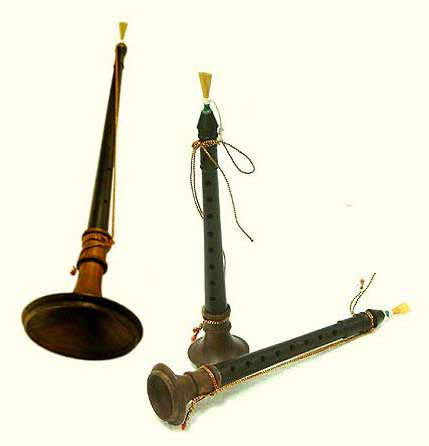

# “Nathaswara Osaiyile” (ehj];tu XirapNy) : An ancient art form that defines a people

Jaffna Monitor
hellojaffnamonitor@gmail.com
38
Background: The eminent scholar late 
Professor Karthikesu Sivathambi in 2003 gave 
an account of the prevailing mood amongst 
academics with an interest in traditional art 
forms of South Asia. “A researcher from an 
American university who was working on Sri 
Lankan music said there was nothing worth 
knowing about carnatic music in this country. 
After all, much of it was a copy of what is found 
in Madras” (One Hundred Tamils of the 20th 
Century. Tamil Nation.org). In response to 
this prevailing attitude, Professor Sivathamby 
posed the following question  “have we done 
justice by musicologists such as Veeramani 
Iyer, Nadaraja Iyer;…..and  Nathaswaram 
players like N. K. Pathmanathan, Balakrishnan, 
Panchapakesan, and the all-time great Thavil 
player Thedchanamoorthy?” (One Hundred 
Tamils of the 20th Century. Tamil Nation.org). 
The answer to this challenge, posed almost 2 
decades ago, still remains a firm NO. Despite 
all the wealth, pomp and pageantry clearly on 
display at functions involving the Sri Lankan 
Tamil community in many Western capitals 
and Sri Lanka, the contributions made by 
members of this community to the world of art 
or music - which surely lie at the very heart of 
any civilised community, still remain opaque 
“Nathaswara Osaiyile” 
(ehj];tu XirapNy): 
An ancient art form that 
defines a people
BY: 
Mahesan Nirmalan
MBBS, MD, FRCA, PhD, FFICM
Manchester, United Kingdom
“What are we when 
stripped away from our 
cultural roots?…..that is 
the question?” 
Special Article
Part-1

Jaffna Monitor
hellojaffnamonitor@gmail.com
39
to the wider world. Any information publicly 
available is largely in the Tamil language and 
hence inaccessible to those not conversant in 
written Tamil. This article is a modest attempt 
by an amateur historian to address this 
important gap by recording the contributions 
made by the Sri Lankan Tamil community 
to Nathaswaram/Thavil music - an art form 
that continues to define the cultural identity 
of Sri Lankan Tamils to this day. Despite 
the impressive achievements by some of its 
proponents, their identities and achievements 
remain largely unknown beyond a small group 
of enthusiasts. The revival of post-war Sri 
Lanka will be incomplete if limited to restoring 
roads, schools, temples and playgrounds alone, 
for it surely must also include inculcating 
a sense of cultural pride amongst the next 
generation. The recognition and archiving 
the contributions by some of the frontline 
Nathaswaram and Thavil Vidwans (a term 
used to describe an accomplished musician) is 
an integral part of this project.
Introductory notes on the history of 
Nathaswaram in Sri Lanka: Nathaswaram 
is a double reed wind instrument, which 
has been considered to be an auspicious 
musical instrument in South India and 
Sri Lanka. Usually performed in temples, 
weddings and other auspicious events in the 
community, it has grown to be an integral 
part of South Indian and Sri Lankan Tamil 
cultures. Accompanied by Thavil, a traditional 
percussion instrument, Nathaswaram renders 
itself as a suitable vehicle to produce a wide 
range of melodies based on classical Carnatic 
or Hindustani traditions and cinema songs 
rooted in classical ragas. Considered to be 
the loudest non-brass musical instrument 
it is referred to in a variety of names such 
as natacuvaram, nadaswaram, nagaswaram 
or nayanam. Nāgasura or nāgasara (than 
Nathaswaram) are the commoner terms used 
to describe this instrument in early literature 
(Yoshitaka Terada; Temple Music Traditions 
in Hindu South India: Periya Mēḷam and Its 
Performance Practice). On the basis of the 
auspiciousness attributed to this instrument 
and its frequent association with Hindu 
temples it is commonly referred to as the 
‘Mangala’ (auspicious) ‘vadyam’ (musical

Jaffna Monitor
hellojaffnamonitor@gmail.com
40
instrument). The loud, majestic, commanding 
but yet versatile nature of the music which is 
highly suited for out-door royal processions 
and/or ceremonies has also lead to the name 
‘Raja’ (or royal) ‘Vadyam’. As the Raja Vadyam, 
tradition dictates that when performed 
it should always be treated as the lead 
instrument in any ensemble and should not be 
delegated to a secondary or supporting roles. 
The origins of Nadaswaram – a historical 
perspective: Wind instruments have been 
an integral part of South Indian culture from 
time immemorial. The ancient Tamil classic 
Cilappathikaram by Prince Ilanko Adikal 
(commonly believed to be composed in the 
5-6th Century AD) frequently refers to Yarl 
(or aho;) and Kulal (or Foy;) as instruments 
performed in dance recitals at royal palaces. In 
the ‘Puhar Kandam’ (or the Puhar Chapter), 
Ilango Adigal refers to:
“ahOk; FoYk; rPUk; kplWk;
jho;Fuy; jz;Zik MlNyhL ,tw;wpd;
,ire;j ghly; ,irAld; gLj;J
tupf;Fk; Mlw;Fk; cupg;nghUs; ,af;fpj;
Njrpf;fj; jpUtpd; Xir filg;gpbj;J”
There can be no doubt from this verse 
that Ilango Adikal is clearly referring to an 
elaborate orchestral performance including 
wind and string instruments embellishing 
Madavi’s dance recital. However it is 
impossible to establish the exact nature of 
these instruments or their modern derivatives. 
As Ilango Adikal has not provided a 
description of the instruments or how they 
were handled by their performers, the exact 
nature of ‘Foy;’ alluded to in Cilappathikaram 
(and other Sangam literature) will remain 
speculative. It may be the bamboo flute 
(commonly used in dance recitals even in 
modern times) or some other instrument 
which may have been a precursor of the 
modern ‘Nathaswaram’. Temple carvings dated 
back to the 13th century at Amrutapura in the 
Chikkamagalur district in Hoysala, Karnataka 
show instruments similar to the Nathaswaram 
being used in royal palaces. Similarly temple 
carvings in Cithambaram in South India 
also show the use of a shorter version of the 
Nathaswaram in temple processions. Even 
though the exact dating of these carvings are 
difficult to establish, post 10th century seems 
to be a fair guess.
It is however possible that the wind instrument 
referred to as the ‘Vangiyam’ (or tq;fpak;) 
alluded to in the Thirumurai - a twelve-
volume collection of holy songs or hymns 
in praise of god in Tamil from the 6th to the 
11th century CE by various poets, makes a 
clear reference to one of the precursors of the 
modern Nathaswaram. The following verse is 
an example:
“VO tpuy; ,il ,l;l ,d;dpir tq;fpak; 
vLj;Jj; 
jhOkyu; tuptz;L jhJ gpbg;gd Nghyr; 
R+OKud;W vo epd;W J}a ngUk; jdpj; 
Jisapy; 
thopa ee;Njhd;wyhu; kzp mjuk; itj;J}
j” (Thirumurai 12.0948) 
The description of the instrument Vangiyam 
in the above verse is that of an instrument 
played standing with seven fingers, while 
blowing through a single hole. Furthermore, 
the description of the nature of the sound 
produced by the Vangiyam in Thirumurai 
12.3097, as being loud and rousing towards the 
culmination of the ceremony can be compared 
with the contemporary practice of sounding 
the ‘Ketti Melam’ (nfl;b Nksk;) which is 
used to highlight the culmination of a wedding 
(the tying of the Thali on the bride’s neck 
by the groom) or the offering of the special 
‘Deepa Arathi’ (or special ornate lamps during 
the Poojas) to the deity adds credence to the 
claim that the instrument Vangiyam referred 
to in Thirumurai may indeed be a precursor of 
the modern day Nathaswaram

Jaffna Monitor
hellojaffnamonitor@gmail.com
41
“rq;nfhL jhiu rpd;dk; jdpg; ngUk; 
fhsk; jhsk; 
tq;fpak; Vid kw;W kyu; Jisf; fUtp 
vy;yhk; 
nghq;fpa xypapd; Xq;fpg; G+Ruu; Ntj fPjk; 
vq;fZk; vOe;J ky;fj; jpUkzk; 
vOe;jJ md;Nw ” (Thirumurai 12.3097)   
The existence of wondering musicians in 
South India has been recognised during 
the Pallava and Pandiya periods extending 
between the 5-9th centuries and their musical 
traditions may have strengthened further 
with royal patronage during the Chola and 
Vijayanagara periods between the 9th-17th 
centuries. Though the exact chronology of 
events remain vague it is probably around this 
time period, with the rise of ‘Saivaism’ and 
‘Vaishnavism’-  with devotion as a key driver 
of social change, these groups of nomadic 
musicians referred to as the ‘Melakarars’ 
(drummers) or ‘Nayanakaras’ (Nathaswaram 
players), became established within the temple 
cultures of South India. Some of these groups 
were native to Tanjavur district in Tamil Nadu 
whereas others migrated from Andra Pradesh 
and Karnataka. The 11th-century inscription 
of Raja Rajah I states that the Tevaratiyar 
(Njtubahu;- female artisans who served 
gods in temples), were invited to serve at the 
Brihadisvara Temple and were given land near 
the temple. In Tamil Nadu, the Tevaratiyar 
and their accompanying troops of musicians 
were often referred to as ‘Chinna Melakarar’ 
(rpd;d Nksf;fhuh;). The term ‘Chinna 
Melakarar’ refers to people who play the small 
drums-like Miruthangam, wind instruments 
(harmonium, flute) and cymbals. The male 
members of the same community were known 
as ‘Periya Melakarar’ (ngupa Nksf;fhuh;). 
The ‘Periya Melakarar’ means those who play 
big instruments such as the Nathaswaram 
and large drums named Thavil (From: T. M 
Krishna. A Southern Music). 
Yoshitaka Terada makes the following 
observations on the history of Nathaswaram 
and Thavil: “the earliest inscription referring 
to these instruments is dated in 1496 and is 
found in Tirumala (Chittoor district, Andhra 
Pradesh). This inscription in Tamil records 
that an equal amount of money (2 paṇam) was 
to be paid to the naṭṭuvar (dance master) and 
muttukkārar (timekeeper), emperumāṉaḑiyār 
(temple dancers), and the players of dola and 
nāgasara (Vijayaraghavacharya 1933, 318–
24). Another Tamil inscription found inside 
the Govindarajasvami Temple in Tirupati 
records the employment of two nāgasvaram 
(nāgasuram) musicians with the contractual 
terms of remuneration (36 rekhai-pon per 
year) (Vijayaraghavacharya 1937, 396–406). 
An inscription, dated 1549 and found at the 
Nilakantha Temple in the village of Nitturu 
(Anantapur district, Andhra Pradesh), reports 
a gift of lands donated to the temple for the 
maintenance of service by six dancing girls, 
Bhavagata chanters and nāgasara musicians” 
(Yoshitaka Terada; Temple Music Traditions 
in Hindu South India: Periya Mēḷam and Its 
Performance Practice. )
From these records it is clear that these 
groups of musicians formed a very distinct 
social group (or social class/caste) in Tamil 
Nadu by the 15th century – the very latest. 
The ‘Peri Melakarars’, ‘Chinna Melakarars’ 
‘Nattuvanars’ and ‘Tevaratiyar’ who formed 
part of these wondering groups were dedicated 
to music, particularly the creation, growth and 
practice of various forms of music and dance. 
Even though the ‘Melakarars’, ‘Nayanakaras’ 
and ‘Tevaratiyar’ were intimately involved 
in the affairs of the temple and the growth 
of traditional Tamil/classical music, they 
were – contrary to expectations, subject to 
social discrimination (perhaps due to their 
wandering/nomadic life styles) and classified 
as ‘other backward classes’ in official records 
(Kalelkar commission 1953). Recognising the

Jaffna Monitor
hellojaffnamonitor@gmail.com
42
vital role played by these groups to the Tamil 
culture, they were renamed as ‘Isai Vellalars’ 
(or cultivators of music) in 1947 by the then 
government of Tamil Nadu. 
Arrival of Nadaswaram and Thavil in Sri 
Lanka: A brief and critical appraisal of ancient 
Sri Lanka’s history shows that there were 
free interactions between the royal houses of 
South India and Sri Lanka. These interactions 
encompassed all aspects of life including 
marriage, governance, military assistance, 
inheritance, economy, and of course culture. 
In such an interconnected system that 
facilitated and encouraged cultural exchanges, 
musical traditions too must have been freely 
exchanged between these kingdoms. There are 
however no historical records that can clearly 
confirm as to when Nathaswaram and Thavil 
may have been adopted by people living in 
Sri Lanka. Ariyapala, notes the use of ‘Naka-
curam’ in the royal courts of mediaeval Ceylon 
in 13th Century CE (Ariyapala. Society in 
mediaeval Ceylon. PhD Thesis, University of 
London 1956). Unfortunately Ariyapala does 
not provide a reference to support this claim 
and hence the reference to 13th century may 
be speculative rather than factual. ‘Yarlpana 
Vaipava Malai’- a brief record of the history 
and life within the Jaffna kingdom from 
mythological times to the takeover by the 
Dutch in 1640 AD, lists all social groups 
(or castes) who were part of society at the 
time, but does not mention the groups – 
‘Melakarars’, ‘Nattuvanars’, and ‘Tevaratiyar’ as 
a distinct group living in the kingdom. Given 
the prominent role played by these groups 
in the activities of the temples – the centre 
stage of social life at the time, the omission of 
these groups in the Vaipava Malai, cannot be 
accidental.  This omission therefore implies 
that the movement of these artisans from 
South India to Sri Lanka was an event that 
followed the period covered in the ‘Vaipava 
Malai. 
There is however no doubt that Nathaswaram 
and Thavil formed an important part of 
cultural life in Sri Lanka from about the late 
18th century. Based on verbal history obtained 
from members of the community, the first 
Nathaswaram Vidwan who arrived in Sri 
Lanka was ‘Sivapunniyam’ (rptGz;zpak;) 
from the village of Thirupuhaloor 
(jpUg;GfY}u;) in Tanjavur district (Source: 
Mr T Ketheeswaran, Nadaswaram Vidwan and 
Mr Balakrishnan, Son in law of Nadaswaram 
Vidwan Mr Panchabikesan). He - along with 
his Thavil partner Sinnaswamy Nattuvanar 
(rpd;drhkp el;Ltdhu;), moved to Jaffna in 
1782 at the invitation of the trustees of the 
Mavittapuram Kandaswamy temple to become 
the resident artists at this temple. Apart from 
this duo who decided to settle long-term in 
the island several other Nathaswaram/Thavil 
artists moved freely to Sri Lanka to perform 
at the annual temple festivals across the entire 
country. Even though most of the temples 
where these performances took place were in 
the Jaffna district, it is noteworthy that temples 
outside Jaffna – Koneswaram temple in 
Trincomalee, Muneswaram temple in Chilaw 
and Ponnampalawaneshwarar temple in 
Colombo, were also attracting many of these 
artists to their annual festivals. Most of this 
migration took place during the Hindu revival 
movement that occurred in the 19th century 
under the leadership of Sri Arumuganavalar. 
In order to seek support for his attempts at 
regularising temple worship and align the 
rituals to the ‘Agamic’ principles, Navalar 
visited the Thiruvavaduthurai Saiva Monastery 
(jpUthtLJiw MjPdk;) in 1849 and the 
interest generated by this visit lead to a large 
number of South Indian priests and temple 
artists developing an interest in performing at 
different temples across the island. Below is a 
summary of the names of some of the artists 
who moved to Sri Lanka in this first wave 
and the temples where they served. (Source: a 
monograph written by Mr T Ketheeswaran, a leading 
contemporary Nathaswaram Vidwan)

Jaffna Monitor
hellojaffnamonitor@gmail.com
43
 
Name of artist
Temple where they served
Suppaiah 
(Nathaswaram)
Nallur Kandaswamy 
Temple
Vaithilingam 
(Nathaswaram) 
Valvattithurai sivan temple
Suppaiah 
(Nathaswaram)
Point Pedro Sivan Temple
Subramaniam 
(Nathaswaram)
Kytes, Karamban sivan 
temple
Thirupuhaloor 
Somaskantha 
(Nathaswaram)
Ponnambala waneshwar 
Temple, Colombo
Palanivel 
(Nathaswaram)
Muneswaram Sivan 
Temple, Chilaw
     
The majority of the above mentioned 
originated from the districts of Tanjavur and 
Tirunelveli in Tamil Nadu. They married into 
families in Pungudu Tivu and Chavakacheri 
areas and made Sri Lanka their homes. 
The descendants of these families continue 
to nurture this art form and, to date, and 
function as its guardians. In more recent 
years, coinciding with the establishment of 
a financially strong Tamil diaspora in many 
western countries, the descendants of these 
early pioneers have taken this art form to 
many countries in Europe, North America, 
Australia and the Far East (Malaysia and 
Singapore in particular). This historical record 
is only a brief snap shot of the history of 
Nadaswaram and Thavil in Sri Lanka and must 
not be taken as a comprehensive or systematic 
analysis of history. However, by all accounts it 
seems most likely that this art form has been 
an integral part of the South Indian culture 
for over 500 years and may have reached the 
shores of Sri Lanka approximately 250 years 
ago. 
Since these early, albeit somewhat vague, 
history regarding its origins and roots, there is 
no doubt that during the past 250 years or so 
Carnatic music in general and Nathaswaram 
& Thavil in particular have occupied a 
central stage in the cultural life of the Tamil 
community in Sri Lanka and has been a key 
component of the community’s identity. 
When we analyse the more recent migratory 
history of the community, it is evident that 
Nadaswaram and Thavil music has followed 
the community wherever they went and has 
been adapted to suit the changing needs 
in asserting their cultural heritage in their 
adopted homes. Many performers who 
migrated to these countries have resurrected 
the musical traditions of their fore fathers and 
have achieved a prominent place within these 
new societies.  
    
The basic structure and evolution of the 
Nadaswaram: The Nadaswaram is a double 
reed wind instrument. It has a long body 
(Kuzal or Foy;) with seven fingering holes 
made of aged wood. Attached to the top 
portion of the tube is a metal staple and a 
small metallic cylinder (kendai) is inserted 
into it. The mouth piece made of the double 
reed (Seevali) is attached to the kendai. The 
lower end of the body is an expanding bell-
shaped base called Anasu. The nadaswaram 
has seven fingering holes placed at equal 
distances along the body of the instrument 
and a further five holes drilled at the bottom 
which act as controllers. Of these five 
supplementary (or control) holes two pairs are 
placed opposite each other called the Brahma 
swarams and the fifth hole is lower down 
called the Adhara Swaram. In appearance and 
quality the Nadaswaram closely resembles 
the ‘Shehnai’, a wind instrument which was 
popular amongst the nomadic musicians 
from North India.  The Shehnai is also made 
out of wood, with a double reed at one end 
and a metal or wooden flared bell at the other 
end. The sound created by the Shehnai is also 
considered to be auspicious and hence was 
quickly adopted into the temple cultures and 
out-door royal processions, just as was the case 
with the Nadaswaram.

Jaffna Monitor
hellojaffnamonitor@gmail.com
44
Very broadly, there are two types of 
Nathaswarams called the Thimiri 
Nathaswaram or the Bari Nathaswaram. The 
Thimiri Nathaswarams are shorter with the 
length of the Kulal measuring approximately 
18-20 inches. It has a higher pitch (4.5-
5 Kattai or G). The Bari Nathaswaram on 
the other hand is longer with the Kulal 
measuring almost 30 inches with a pitch 
varying between 2.5 or 3 ‘Kattai’ (D, D Sharp 
or E). From an evolutionary point of view, 
it appears that the Thimiri Nathaswarams 
predates the Bari, and may be a more direct 
derivative from the Shehnai of North India. 
It also appears that the transition from the 
former to the latter occurred during the 
time of the most legendary Nathaswaram 
Vidwan - T N Rajarthnam Pillai (or TNR; 
1898-1956), from Thiruvavaduthurai in Tamil 
Nadu. The musical collaboration between 
TNR and a traditional Nathaswaram maker 
- Ranganathan Achari, from Narasingapettai 
(a village near Kumbakonam, Tamil Nadu)  
around 1955 resulted in the Bari Nathaswaram 
where ‘all the seven swaras spoke’ and the 
lower pitch emanating from a more majestic 
looking longer instrument appealed to the 
outdoor temple environment in which the 
instrument was used most frequently and the 
tastes of the listening public who were mostly 
temple devotees (T. M Krishna, The Southern 
Music). The Thimiri Nathaswaram however 
is still in use by some of the Nathaswaram 
Vidwans. For example, in the mid 1970s a 
group of Nathaswaram players from Sri Lanka 
– such as the legendary N K Pathmanathan 
from Alavetti and Mr Panchamoorthy from 
Kondavil, experimented with the Thimiri 
Nathaswaram for a brief period leading to a 
great break from tradition. It must be noted 
that some musicians such as Vidwan M 
Panchapikesan refused to change their practice 
and remained loyal to the low-pitched Bari 
Nathaswaram. The resultant controversy lasted 
for a short period with the entire community 
subsequently deciding to settle for the use 
of the Bari, mostly due to pressure from the 
listening public, temple authorities and concert 
organisers. The relative difficulty and the 
greater (physical) effort required in handling 
the Thimiri Nathaswaram meant that the older 
(and perhaps physically weaker) Vidwans were 
not able to perform with the Thimiri for long 
periods and hence the community may have 
decided to settle for the Bari as most concerts 
– especially temple based performances, 
necessitated people from different generations 
having to perform together. There is also no 
doubt that the Bari Nathaswaram was a more 
elegant instrument and the extra length added 
to a sense of majesty which enhanced the 
visual appeal of the performers at out-door 
processions/concerts 
Notable Vidwans of recent times: With the 
information currently available to us, it is 
not possible to come up with a complete 
record of artists who have helped shape 
the Nathaswaram/Thavil landscape in 
Sri Lanka. The following list is compiled 
from a monograph written in Tamil by 
Mr T Ketheeswaran, who was one of the 
accompanying artists of Alavetti N K 
Pathmanathan. Ketheeswaran currently lives 
in Sri Lanka and is an accomplished artist in 
his own right. The information provided by 
Ketheeswaran was cross referenced against 
information provided to the author by late 
Mr Balakrishnan (Son in Law of late Mr M 
Panchabikesan), Vidwan M K Nagenthiran 
(Son of late Mr M Panchapikesan) and Mr 
Panchamoorthy – one of the few remaining 
Vidwans from the older generation. For ease 
of classification the list of Vidwans is classified 
as early (1900-1970), intermediate (1970 – 
2009) and contemporary (2009- present). This 
classification is entirely arbitrary and is based 
on the subjective impressions of the author 
(and his team) and the lack of completeness is 
acknowledged.

Jaffna Monitor
hellojaffnamonitor@gmail.com
45
Nadaswaram
Thavil
Early Vidwans
Nallur Murugaiah 
Pillai
Jaffna 
Kamachisundaram 
Sinnathurai
Chavakacheri 
Shanmugam Pillai
Inuvil Sinnathambi 
Kanagasabapathy
Jaffna Appulingam 
Pillai
Periya Palani  
(ngupa godp)
Mavittapuram Rajah
Chavakacheri 
Murugappa Pillai
Kondavil 
Gothandapani
Jaffna Rajagopal
Navali 
Govindaswamy
Periya Ganesu (ngupa 
fNzR)
Seerkali 
Thirunavukarasu
Inuvil Viswalingam
Inuvil Uruthiraapathi Jaffna Palanivel 
(Sinna Palani)
Mavittapuram 
Uruthirapathi
Jaffna Kandaswamy 
Pillai
Jaffna Ramaiya Pillai 
Intermediate Vidwans
Alavetti N K 
Pathmanathan
V Thakshinamurthi
Kondavil 
Balakrishnan
N R Sinnaraja 
(Inuvil)
Chavakacheri 
Panchabikesan
K Kanesapillai 
(Nachimarkoviladi)
Vadiri Thurairajah
R Puniyamurthy 
(Inuvil)
Kondavil 
Ganamurthy/
Panchamurthy 
Brothers
N Kumaraguru 
(Alavetti)
Sithambaranathan
M Nadarajasundaram 
Pillai (Chavakacheri)
Contemporary Vidwans
T Ketheeswaran 
(Alavetti)
Allavetti Udaya 
Shanker 
M P Nagenthiram 
(Chavakacheri/
Canada)
Inuvil Suthakaran
P Kumaran 
(Kondavil)
Inuvil P S Senthil 
Nathan
P S Balamurugan 
(Nallur)
Inuvil P Vipoornan
Manipay N Prasanna
	
The above list, as mentioned before, is not 
comprehensive, and it is certain that some 
key artists – possibly giants at their times, 
have been missed out. In a society, which has 
been notably poor in recording, archiving 
and preserving activities that define their 
history, we have to depend on oral history to 
place on record the key milestones. Despite 
the incompleteness, it is essential to record 
the lives and achievements of six major 
personalities in this space for posterity.
1.	Kalasuri Alavetti Dr N K 
Pathmanathan: 
	
Kalasuri N K Pathmanathan or Alavetti 
N K Pathmanathan (NKP) as he was 
popularly known within the music circles, 
was simply the most brightly shining 
star amongst the galaxy of Nathaswaram 
Vidwans from Sri Lanka. NKP was born 
in the village of Alavetti in the Jaffna 
district in 1931 (19/09/1931). His father’s 
name was Nagalingam Kandaswamy 
and his mother’s name was Parimalam 
Kandaswamy. His father was also an 
accomplished Nathaswaram Vidwan, and 
as such, NKP had his early training from 
his father at home. He went on to receive 
further apprenticeship with Jaffna P S 
Kandaswamy Pillai (fe;jrhkpgps;is) and 
further lessons during the period 1945-
1955 from the visiting Vidwan, Seerkali 
Thirunavukarasu (rPu;fhop jpUehTf;fuR). 
This period is considered to be crucial 
in NKP’s subsequent development as an

Jaffna Monitor
hellojaffnamonitor@gmail.com
46
outstanding Nathaswaram Vidwan who 
was respected all over the Tamil-speaking 
world. The joint performances with his 
Guru Thirunavukarasu for approximately 
two years drew the attention of many 
critiques and fans. NKP is reported to 
have stated that the opportunity he had in 
working in the troupes of maestros such 
as SS Appulingam Pillai (mg;Gypq;fk; 
gps;is), S Murugaiah Pillai (KUifah 
gps;is) and P A Arumugam Pillai 
(MWKfk; gps;is) as the time keeper 
(or cymbal player - ry;yb) helped him 
to acquire a very fine understanding 
of timing and its variations during the 
course of a performance. Throughout his 
subsequent career he was highly acclaimed 
for his control of the rhythm and timing 
while performing even the most complex 
‘keerthanas’ (fPu;j;jid), pallavi (gy;ytp), 
Kalpanaswarms (fy;gdh ];tuk;) and 
Thillanas (jpy;yhdh). He kept the listeners 
spell bound with his ‘Mallari’ (ky;yhup) 
performances at the annual Nallur 
Temple festivals where he served as the 
Asthana Vidwan (M];jhd tpj;Jthd;) 
for almost 40 years. The Thavil maestro 
Yalpanam Thakshinamurthi (aho;g;ghzk; 
jÑzh%u;j;jp) and Thavil Vidwan P S 
Sarangapani (rhuq;fghzp) are two of the 
notable Thavil Vidwans who were members 
of his troupe. The Nathaswaram Vidwans 
who performed along with NKP include 
Mr Balakrishnan and Mr R Ketheeswaran 
– with the latter being his longstanding 
partner. However, it is fair to say that 
NKP has performed jointly with almost 
all frontline Vidwans of his time – both 
in Sri Lanka as well as in South India. In 
recognition of his contributions, he was 
honoured at the 1963 ‘Kumbabishekam’ 
(Fk;ghgpN~fk;) of the Muneswaram 
Temple in Chilaw by the legendary 
musician Maharajapuram Santhanam 
(kfhuh[Guk; re;jhdk;). In 1964 at the 
Sekilar Festival (Nrf;fpohu; kfhehL) the 
title ‘Nathaswara Kalanithi’ (ehj];tu 
fyhepjp) was conferred on him by Sir 
Kandaiah Vaithiyanathan. NKP has the 
unique honour of having performed at the 
West Minister Abbey in 1978. In 1982, the 
government of J R Jayawardena conferred 
the ‘Kalasuri’ award – the highest national 
award for an artist conferred by the state. 
In 2004, the University of Jaffna conferred 
a Hon Doctorate on NKP for the services 
rendered. 
	
NKP was the father of 4 boys and three 
girls. The last stages of NKP was marred by 
the untimely death of one of his sons (the 
sole heir to his divine music) at the hands 
of the Indian Peace Keeping Force (IPKF). 
Mass displacement and the tragic loss of his 
son compelled a dejected NKP to move to 
Colombo where he continued to perform 
at the Colombo Captain Gardens Temple 
Kalasuri Alavetti DR N K Pathmanathan- the legendary 
Nadaswaram player of all time

Jaffna Monitor
hellojaffnamonitor@gmail.com
47
– largely to an audience who were unaware 
of the grandeur and fame of NKP in his 
prime. The sight of a diminished NKP 
performing at the Captain Garden Temple 
will no doubt haunt all of us who knew 
him as the ‘Nathaswara Chakarawarthi’ 
(ehj];tu rf;futh;j;jp – or the emperor 
of Nathaswaram) who reigned over the 
world of Carnatic music for over 3 decades 
from his humble home in Alavetti. NKP 
passed away at the age of 72 and his 
daughters currently live in Sri Lanka and 
Germany.           
 
2.	Dr M Panchapikesan: 
	
Whilst NKP was the ‘Northern Star’ in the 
world of Nathaswaram, there can be no 
doubt who the ‘Alpha Curcis’ was. Born 
in 1924 as the eldest son of the highly 
acclaimed Thavil Vidwan – Chavakacheri 
Murugappa Pillai (KUfg;ghgps;is), Dr 
M Panchapikesan reined over the world 
of Nathaswaram music in Thenmaratchi 
(njd;kuhl;rp- the Southern part of Jaffna 
district) until his death in 2015. His father, 
Murugappa Pillai was one the leading 
Thavil artists of his time. Accompanying 
Nadaswaram Vidwans Appulingam Pillai 
and Shanmugam Pillai, the group pioneered 
the concept of two Nathaswaram/Thavil 
Vidwans playing in tandem at concerts. 
This innovation was considered a major 
mile stone in the evolution of Nathaswaram 
music drawing attention of musicologists 
and enthusiasts from across the world. 
The privilege of having born as the son 
of this percussion maestro, introduced 
young Panchapikesan to the world of 
Nathaswaram music at a very young age. 
Through the efforts of his father, he had 
his early training from the prodigies of the 
time – Appulingam Pillai and Shanmugam 
Pillai. Having demonstrated his skills to 
the wider world at the tender age of 14 – at 
NKP performing with Alavetti Mr T Ketheeswaran (Left) – a long term accomplice and disciple and Point Pedro S N Rajathurai 
(Right)- also referred to as Pallavi Mannan (The king of Pallavies- a form of carnatic musical composition popular at 
Nadaswaram concerts).

Jaffna Monitor
hellojaffnamonitor@gmail.com
48
the Sitti Vinayagar Temple concert in Point 
Pedro, he proceeded to India for further 
training. He had the privilege of living 
in the house of the all-time legendary T 
N Rajaratnam Pillai for almost one year 
and this period no doubt accounts for 
the dizzy heights Panchabikesan was to 
ascend subsequently in his musical career. 
The Thavil artist who accompanied him 
for over 40 years was his own brother 
Chavakacheri Nadarajasundaram Pillai. 
Panchapikesan performed many concerts 
where he was accompanied by Allavetti 
Thakshinamurthi, the all-time great 
Thavil player. It is reported that it was 
the desire to accompany Panchapikesan 
that brought Thakshinamurthi back to 
public performances after a brief break in 
his career due to ill health. The blend of 
traditional Carnatic compositions, selected 
versions of cinema songs and the songs of 
Subramaniya Bharathi made his concerts 
highly sought after by people of all age 
groups. The tall traditional appearance – 
adorned with holy ash and ‘pottu’ on his 
forehead and his long and flowing hair 
tied behind in a ‘Kondai’ (nfhz;il), 
added a sense of intrigue to his concerts. 
As the resident artist of the sacred 
Thiruketheeswaarm (jpUNfjP];tuk;) 
temple in Mannar – one of the Pancha 
Eswarams of ancient Sri Lanka, he was 
highly sought after from around the 
country and the entire Tamil speaking 
world. Together with NKP and other 
frontline Nathaswaram players of his time, 
there is no doubt that Panchapikesan played 
a major role in developing this divine art 
form arguably several notches higher than 
what their counterparts in South India were 
able to achieve. Highly prestigious awards 
and titles followed. It is noteworthy that one 
of the first gold medals that was awarded to 
him was from a group of Islamic scholars at 
an Islamic religious festival held in Jaffna. 
The secular nature of the music that flowed 
from his Nathaswaram, clearly appealed to 
all segments of the society.
The Jaffna University conferred the Hon 
Doctorate on Panchapikesan in 2010. The 
genre of Panchapikesan’ s music thrives and 
continues to grow to this day through his two 
Dr Panchapikesan in later Years.
Left to right: Kondavil Ganamurthy, Kondavil Panchamurthy 
(Ganamurthy/Panchamurthy brothers), Chavakacheri Dr M 
Panchapikesan, Alavetti Dr NKP, Alavetti R Ketheeswaran 
and Inuvil N R Sundaramurthy. The legendary Nadaswaram 
Vidwans performing together at a Thiyagaraja Festival. Year is 
unknown, but probably in the mid 70s

Jaffna Monitor
hellojaffnamonitor@gmail.com
49
illustrious sons – M P Nagenthiran and M P 
Vigneswaran who are both highly acclaimed 
Nathaswaram Vidwans in Canada and Sri 
Lanka respectively. His grandsons continue the 
family tradition to this day in Sri Lanka and 
across the world                
3.	Vidwan Vathiri K Thurairajah (KT): 
	
Vidwan Thurairajah’ s story is a key land 
mark in the history of Nadaswaram in Sri 
Lanka for a wide variety of reasons that go 
well beyond music. Vadiri is a small village 
close to Nelliady in the Vadamarachi region 
close to Point Pedro. The social and caste 
based discriminations widely prevalent in 
the Jaffna peninsula at the time prevented 
the incorporation of Nathaswaram and 
Thavil music at the temples festivals in 
this village. In response to this injustice, 
members of this community jointly 
identified youth amongst them who were 
gifted musicians and sponsored them to 
develop their skills in South India. One 
of the prodigies who came through such 
a challenging and discriminatory system 
was K Thurairajah (KT). KT was born in 
1922 (18/7/1922) to ‘Kattaiyar’ (Presumably 
meaning short man) and Letchumi. The 
family lived in Karavetti west, in the lands 
commonly referred to as ‘Appa Valavu’ 
(mg;gh tsT). KT had his early education 
at the Vathiri North Methodist Mission 
school and started his musical career, 
through his own efforts accompanying 
his brother Thavil Vidwan K Kundumani. 
The discriminatory practices meant that 
KT was unable to find a suitable mentor/
teacher within Jaffna, where the art form 
was propagated almost entirely within the 
Isai Vellalar families based on the Guru-
Kulam traditions. He therefore travelled 
to Thirunelveli in Tamil Nadu where he 
trained under Vidwan M R Guruswamy. 
On his return KT and his brother K 
Kundumani joined hands in performing 
concerts at temples and social functions 
– predominantly within their own 
communities, across the peninsula. The 
duo was popularly known as Kundumani-
Thurairajah Brothers. His first public 
performance was at the Achuveli Navakadu 
(mr;RNtyp ehtf;fhL) murugan temple 
where he mesmerised a stunned audience 
and created a fan club for himself. Despite 
severe hardships and limited opportunities 
available to him - as a result of caste based 
discriminations, KT continued to out-
perform many of his contemporaries who 
came from more established backgrounds. 
For more than 25 years he was listed 
amongst Grade A list of artists by radio 
Ceylon and the resultant opportunities 
brought fame to the Kundumani-
Thurairajah brothers nationally.
The fame brought disciples from across the 
peninsula, with many of his students over 
coming very stiff social barriers in associating 
and learning from KT. One of the very 
notable disciples of KT is P S Balamurugan, 
who arguably is one of the most popular and 
accomplished current Nadaswaram artist. 
When interviewed by the writer, Balamurugan 
was reduced to tears at the scale of injustice 
KT had to endure in his musical career. In 
one occasion, when young Balamurugan was 
invited to play at one of the illustrious and 
historic Murugan temples in the Jaffna district 
(Not Nallur Kandaswamy Temple), KT was 
unable to attend and had to remain in a car, 
parked far away listening to the mesmerising 
performance of his disciple. On the return 
journey he is reported to have stated with tears 
in his eyes “I am glad you have been given 
opportunities that were not available to me”. 
Such was the scale of caste based injustice in 
the peninsula. KT clearly was a man of great 
fortitude, character and charisma that he was 
able to withstand such blatant injustices and 
remain loyal to his music to his last days. 
Eventually, through his sheer skills and

Jaffna Monitor
hellojaffnamonitor@gmail.com
50
mastery he did overcome many of these 
discriminatory practices with honours 
being bestowed upon him at many temples 
including the Karainagar Sivan Temple. 
Having listened to his performance at 
Mattuvil ‘Panri Thalaichi’ Amman temple 
Ganamurthy/Panchamurthy brothers are 
believed to have concurred that, had KT been 
born in a more traditional musical family 
the two of them would have been completely 
overshadowed to a point of oblivion. Veteran 
Maestro Appulingam Pillai in 1960 bestowed 
the title ‘Gana Kaladaran’ (fhd fyhjud;) 
and honoured him by wrapping him in the 
traditional ‘Golden shawl’. Alavetti N K 
Pathmanathan too has joined the list of artists 
who have celebrated the achievements of KT 
in the world of Music. Having delighted his 
fans over 7 decades KT passed away in dignity 
on the 11th October 2009.              
 
4.	Thavil Chakarawarthi (Emperor 
of Thavil) , Karavege Kesari 
(The king of finger speed), 
Karpanai Surangam (the mine of 
creativity) Thavil Vidwan Inuvil V 
Thakshinamurthi
	
Thavil artist Inuvil V Thakshinamurthi, 
epitomises the very essence of this short 
review, that the proponents of this art-
form from Sri Lanka, in many respects 
out performed their counterparts in South 
India. In terms of finger speed, variety and 
clarity of notes even at very high finger 
speeds, it is fair to say there has been no 
other percussion artist who could match 
Thakshinamurthi to this day. The contrast 
with other Thavil/percussion artists of 
his time was so stark that the renowned 
 Illustrious Nadaswaram Vidwan Vadiri K Thurairajah. A 
musician par-excellence who rose to fame despite the wider 
community that tried to supress his talents and personality.
A youthful P S Balamurugan, greeting his Guru Vidwan 
‘Gana Kaladaran’ K Thurairajah. This represents the 
wider community’s acceptance of KT and his sheer musical 
excellence

Jaffna Monitor
hellojaffnamonitor@gmail.com
51
Miruthangam Vidwan Palakkad Mani 
Ayer (ghyf;fhL kzp Iah;) referred to 
Thakshinamurthi’ s Thavil talents as the 8th 
wonder of the world.
Thakshinamurthi was born in the village 
Inuvil, in the Jaffna district in 1933 to Thavil 
Vidwan Viswalingam and his wife Rathinam. 
As per the traditions of the Guru Kulam, he 
had his early training at home followed by 
formal lessons with Nachiyar Kovil Raghava 
Pillai (ehr;rpahu; Nfhtpy; uhft gps;is). It 
is claimed that after training him for one year 
Raghava Pillai stated that there was nothing 
further he could teach his highly motivated 
young disciple. His passion was such that 
he would constantly train for over 12 hours 
at a stretch reaching new heights – both in 
finger speed and in rhythmic clarity and 
creativity. Commenting on his training the 
prestigious news daily Hindu commented 
that he was “a largely self-taught genius”. (The 
Hindu 13th June 2016) His contemporaries 
include Yalpanam Kamachisundaram Pillai 
(aho;g;ghzk; fhkhl;rpRe;juk; gps;is), 
Inuvil Sinnathambi (,Ztpy; rpd;dj;jk;gp) 
and P S Rajagopal – all highly accomplished 
Thavil Vidwans. He also played Thavil with 
some legendary Thavil players from Tamil 
Nadu including Thiruvizhanthur Ramadasa 
Pillai (jpUtpoe;J}u; uhkjhr gps;is), 
Valangaiman Shanmugasundaram Pillai 
(tyq;ifkhd; rz;KfRe;juk; gps;is), 
Vadapathimangalam Thakshinamurthi Pillai 
(tlgjpkq;fyk;  njl;rpzh%u;j;jp gps;is) 
and Needamangalam Shanmugavadivel 
(ePlkq;fyk;  rz;KftbNty;). In Jaffna 
he accompanied all frontline Nadaswaram 
Vidwans of his time including N K 
Pathmanathan and M Panchapikesan. There 
is some suggestions that he may have had 
a greater affinity towards the supportive 
personality, style and skills of Panchapikesan 
over other Nadaswaram artists. In India, he 
A dashing Thakshinamurthi, who practiced a very traditional art form, but kept up with the trends 
and fashions of his times. The contrast between the two photos represent the two sides of his 
personality and why he was considered a phenomenon

Jaffna Monitor
hellojaffnamonitor@gmail.com
52
accompanied several frontline Nadaswaram 
Vidwans including Thiruvaduthurai 
Rajaratnam Pillai (jpUthLJiw uh[uj;jpdk; 
gps;is), Karaikudi Arunachalam (fhiuf;Fb 
mUzhr;ryk;), Namagiripettai Krishnan 
(ehkfpupg;Ngl;il fpU~;zd;) and the famous 
Sethuraman-Ponnusamy brothers (NrJuhkd;-
nghd;Drhkp).  
In 1961- at the height of his career, Czech 
Television journalists were sent to Sri Lanka to 
film his performance and the magical flow of 
rhythms from his Thavil. He was also invited 
to perform at the daughter’s wedding of Mr 
Sivaji Ganeshan- the iconic Tamil film star. 
Thakshinamurthi was an extremely stylish 
personality. His popularity, skills, presence 
and character aided the entire Thavil fraternity 
to achieve a higher professional standing 
within the musical world and the ability to 
charge higher fees for their contributions. 
It is perhaps for this reason that the name 
of Thakshinamurthi continues to receive an 
element of reverence within the entire Isai-
Vellalar community both in Sri Lanka and 
India. 
Thakshinamurthi spent a few years of 
his career Tanjavur in Tamil Nadu and 
commenting on this period further, the Hindu 
daily had the following to say “It was during 
his few years in Tanjavur that Thavil maestro 
Thakshinamurthi Pillai saw his career peak. 
It was also in Tanjavur that he got rather 
disillusioned with the music field” (The Hindu 
13th June 2016). Despite his musical genius, 
popularity and fame, Thakshinamurthi was 
prone to bouts of severe depression, which 
first manifested during his stay in Tanjavur 
and resulted in prolonged breaks in his career. 
It remains unclear if this was recognised 
and managed adequately on his return to Sri 
Lanka. His untimely death at a very young age 
of 42 in 1975 was a very significant blow to his 
family, the community of Isai Vellalars in Sri 
Lanka and the entire world of Carnatic music.
                                    
Thakshinamurthi was the father of 5 
children and his son Udayasanker is the 
only descendant who remained in Jaffna to 
continue the legacy. Commenting on the 
career of Thakshinamurthi, fellow artist and 
cousin Yalpanam Ganeshan (aho;g;ghzk; 
fNzrd;) said “he came, he conquered and 
he perished” (The Hindu 13th June 2016). 
Thakshinamurthi continues to live in the 
minds of all us who loved his music through 
the life of his son Udayasanker who continues 
to delight the countless fans of his father 
across the world by his dedication and skills. 
Thakshinamurthi’ s life and death raises 
important questions that remain very relevant 
to the present day. 
The fact is that even highly successful 
individuals - who are stars in their chosen 
fields, and are subjects of public adoration can 
become victims of their own success. Serious 
mental health issues such as depression and 
substance misuse – particularly alcohol or 
even other recreational drugs are some of the 
common manifestations of the sheer pressure 
they are subject to - both by themselves and 
the wider society. It is the duty of society, 
elders within these communities/families and 
the state to cater to these needs. It seems that 
such support systems are not available even 
now - in Sri Lanka in general and the Tamil 
community in particular. Establishing such 
support systems within the world of art and 
music is a pressing need and would be a fitting 
tribute to the musical maestro who “came, 
conquered and perished”
The future Trajectory of Nathaswaram/
Thavil music: Nathaswaram and Thavil 
music in Sri Lanka has a rich history of over 
250 years and a star- studded landscape. 
There is no doubt that of all the different art 
forms, whose origins can be traced to the 
Indian subcontinent, the proponents of this 
art form in Sri Lanka matched, and in many

Jaffna Monitor
hellojaffnamonitor@gmail.com
53
instances, exceeded their Indian counterparts 
in the skill, understanding and performance. 
They have been innovative and as a result 
developed their skills to new heights, while 
being true to its history, traditions and the 
spiritual/religious connotations. With a strong 
Tamil diaspora spread all over the Western 
hemisphere, a new generation of artists are 
now on the move displaying their mastery and 
skills across the globe with suitable honours 
and financial rewards being bestowed upon 
them. In meeting the expectations of this new 
audience, it has been necessary for them to 
deviate from their traditional playing styles – 
with greater emphasis on cinema songs and 
other lighter forms of music. Whether this 
change in focus will lead to distortion and 
perhaps diminish this art-form is a question 
that needs careful consideration and reflection. 
Whilst change is inevitable, deviation from 
its traditional base carries the risk of this art 
form losing the sanctity associated with its 
practice. This will be a travesty and surely 
lead to the loss of respect and integrity their 
ancestors have so carefully 
nurtured over centuries. There is 
therefore a special responsibility 
placed on the shoulders of the 
current generation of artists to 
consider how the changes should 
be regulated and what aspects 
of the age-old traditions may be 
dispensed with. There is no doubt 
that the Guru-Kulam framework 
that has sustained this art-form for 
centuries does not allow students 
from different backgrounds to 
learn Nathaswaram and Thavil.  
As members of the traditional 
music families are subject to the 
economic currents of migration, 
the practice of music must be 
made available to all those who 
seek to learn and perhaps the 
Guru-Kulam framework needs 
to be adapted (not necessarily 
eliminated) to accommodate these changing 
needs.
The current generation of performers stand 
on the shoulders of artistic giants and 
hence will surely be able to see beyond the 
horizons of their ancestors. In this context, 
it is very reassuring to see that artists such as 
Panchamurti Kumaran, P S Balamurugan, 
T Udayasanker, P S Senthil Nathan and 
Vipoornan who are constantly experimenting 
with the transformation have, in general, 
stood broadly within the Carnatic musical 
traditions while accommodating the requests 
for more popular cinema music. The critics 
of this transformation must remember the 
age old saying ‘gioad fopjYk; Gjpad 
GFjYk; tOty’ (the loss of old practices 
and the adoption of new ones is not a mistake) 
- the Nadaswaram/Thavil music cannot be the 
exception.  
To be continued in the next edition.

